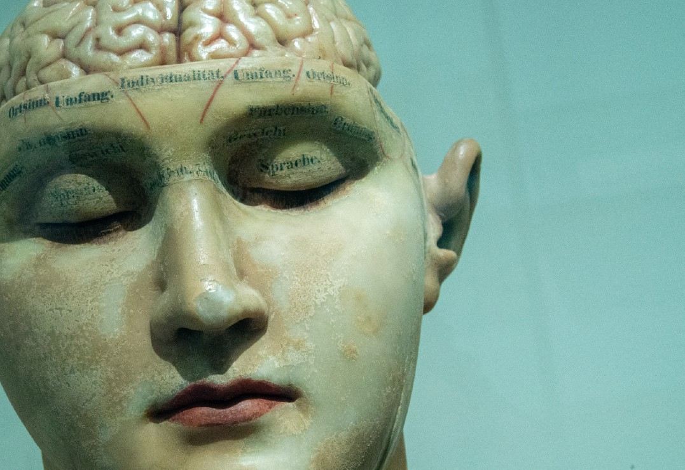

<p align="center"></p>

This repository contains the MAIDS description for project U21-01. It was built by cloning the [MAIDS-Template](https://github.com/PERSIMUNE/MAIDS-Template). You will find more details about this dataset below with links to visit the website and download the PDF.

>MAIDS is currently being prototyped for the [Copenhagen Ultrathon on Precision Medicine](https://ultrathon.online) where you will find more information about the event. You may also be interested in viewing other examples listed in the 2021 Ultrathon [Project Pool](https://github.com/UltrathonOnline/U21-PROJECT-POOL).

There are several ways to stay informed:
* Visit the Ultrathon's [landing page](https://ultrathon.online) and sign up to the mailing list.
* Follow us on [Twitter](https://twitter.com/UltrathonOnline).
* Watch the repository for changes.

---

### **U21-03**: Consciousness in neurocritical care cohort study
<p align="center"></p>

>Visit the [website](https://ultrathononline.github.io/MAIDS.U21-03.Consciousness/) for this dataset or download the formatted [PDF](./docs/maids.pdf).
```
Daniel Kondziella, Moshgan Amiri
@: Rigshospitalet, Copenhagen, Denmark

Research on consciousness is mainly based on patients suffering from chronic brain injury, while data
regarding unresponsive patients with acute brain injury are sparse. As mentioned in the previous section,
most deaths in an ICU population occur because of withdrawal of life-sustaining therapy. Reducing the
risk for erroneous clinical prognostication is therefore crucial. There is a gap between the research on
chronic patients and research based on unresponsive patients suffering from acute brain injury in the ICU.
We established our database to be able to fill this gap. Our dataset was hence created to obtain a
representative prospective database with systematic registration of clinical, laboratory and imaging data
of unresponsive patients suffering from acute brain injury. The main purpose of the database is to
identify important information predicting level of consciousness and outcome (acute and long-term) in
these patients, which will help to optimize clinical decision-making.
```


